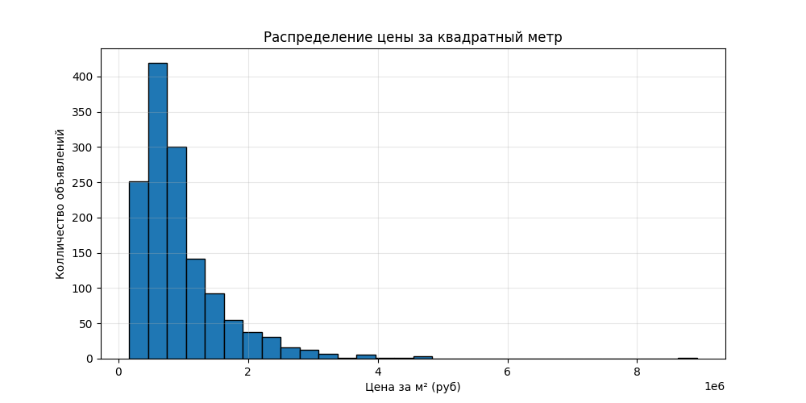
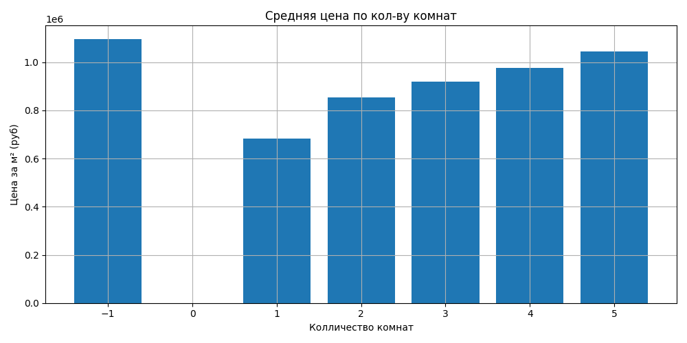
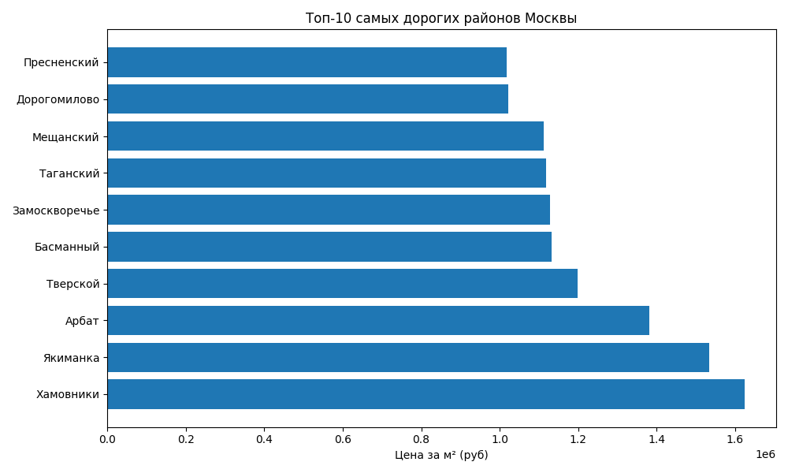

# Анализ рынка жилой недвижимости Москвы

## Бизнес-задача
Определить текущую ситуацию на рынке жилья Москвы: средние цены, зависимость стоимости от площади и района, а также выявить наиболее дорогие сегменты.

## Источник данных
- **Платформа:** ЦИАН (cian.ru)
- **Дата сбора:** 19 апреля 2025 года
- **Объём:** 1399 объявлений о продаже квартир
- **Ссылка на исходный датасет:** [Moscow_market_analysis](https://github.com/xenonblaq/Moscow_market_analysis)

## Используемые инструменты
- Python 3.14.3
- Pandas — загрузка, очистка и агрегация данных
- Matplotlib — визуализация

## Ключевые выводы

### 1.Общая характеристика рынка
- **Медианная цена за м²:** 751629.6482728245 ₽
- **Среднее количество комнат:** 2.68

### 2.Зависимость цены от количества комнат
| Комнат | Цена за м² (₽) |
|--------|----------------|
| 1      | 653 272        |
| 2      | 826 694        |
| 3      | 901 668        |
| 4      | 969 208        |
| 5      | 1 030 730      |

**Вывод:** С увеличением количества комнат цена за квадратный метр растёт. Самый дорогой сегмент - 5-комнатные квартиры.

### 3.Топ-5 самых дорогих районов
1. Хамовники — 1 623 431 ₽/м²
2. Якиманка — 1 534 524 ₽/м²
3. Арбат — 1 382 048 ₽/м²
4. Тверской — 1 197 538 ₽/м²
5. Басманный — 1 132 112 ₽/м²

**Вывод:** Центральные районы Москвы ожидаемо лидируют по стоимости жилья.

### 4.Распределение цен за м²
На гистограмме виден длинный правый хвост — наличие дорогих элитных объектов, которые значительно повышают среднее значение. Медиана — более устойчивая метрика для оценки рынка.

## Визуализации
### Распределение цен за квадратный метр


### Средняя цена по количеству комнат


### Топ-10 самых дорогих районов Москвы


## Как запустить проект
1. Клонируй репозиторий:
   ```bash
   git clone https://github.com/blesgood/cian_flats_analysis_2025